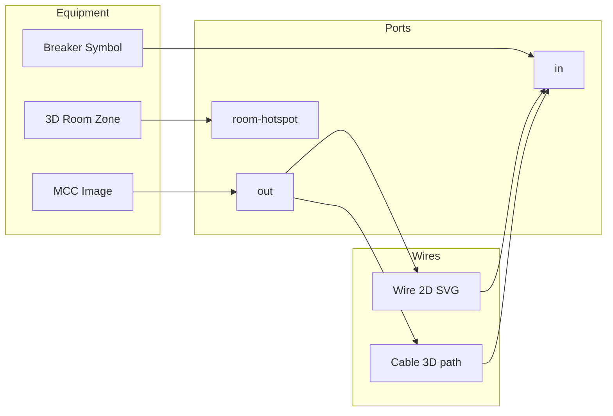

# EnergyL2 Graphics — Master Tool Plan & AI Prompt

เอกสารนี้ใช้เป็น **แผนพัฒนา**, **checklist**, และ **prompt สำหรับ AI/ทีม** เพื่อทำให้ Graphics Designer ยืดหยุ่น ครบ SCADA/EMS และขยายได้ในอนาคต

> **ฉบับสมบูรณ์ (ทุก tool + properties + prompt):** [GRAPHICS_TOOLS_COMPLETE_REFERENCE.md](./GRAPHICS_TOOLS_COMPLETE_REFERENCE.md)

---

## 1) เป้าหมายหลัก

| เป้าหมาย | คำอธิบาย |
|----------|-----------|
| **Real data only** | ค่าทุก widget มาจาก Engine (`/api/tags/current`, `/api/trend`, `/api/alarms`) — ห้าม mock |
| **Tool ยืดหยุ่น** | ทุก object ปรับได้: binding, style, visibility, animation, navigation, threshold |
| **Editor = Runtime parity** | สิ่งที่เห็นใน Live Preview ต้องตรง Monitor / Web Viewer |
| **SLD-first** | รองรับหน้า Single-Line, MCC, Feeder, Transformer แบบมืออาชีพ |
| **Portable** | Export/Import `.graphic.json`, template, asset library |

---

## 2) Tool ที่มีอยู่แล้ว (Inventory)

### Layout (7)
| Tool | สถานะ | ความยืดหยุ่นปัจจุบัน | ควรเพิ่ม |
|------|--------|----------------------|----------|
| Text | ✅ | สี, ฟอนต์, ข้อความ | Dynamic text จาก tag, หลายบรรทัด, align, opacity |
| Image | ✅ | เลือกจาก Setup Images | SVG, scale mode (cover/contain), link URL |
| Rectangle | ✅ | สี, border | Corner radius, gradient, shadow |
| Line | ✅ | สี, ความหนา | มุมเอียง, arrow head, dashed |
| Circle | ✅ | สี, border | Ellipse, arc |
| Polygon | ✅ | พื้นฐาน | แก้จุด vertex แบบ flow path |
| Panel | ✅ | กรอบพื้นหลัง | Title bar, collapsible, nested group |

### SLD / Bus (3)
| Tool | สถานะ | ความยืดหยุ่นปัจจุบัน | ควรเพิ่ม |
|------|--------|----------------------|----------|
| Flow Path | ✅ | path points, flow tag, enable, threshold, overload, copy style | Bidirectional flow, pipe width ตามค่า, color scale |
| Elec Symbol | ✅ | breaker/disconnect/transformer/bus/meter/motor/ct/pt/generator/ats, trip flash | Symbol rotation, label จาก tag, custom SVG symbol |
| Hotspot | ✅ | navigate, tooltip action | Popup panel, drill-down device, write command |

### Values (5)
| Tool | สถานะ | ความยืดหยุ่นปัจจุบัน | ควรเพิ่ม |
|------|--------|----------------------|----------|
| Value | ✅ | tag bind, conditional color | Format string, prefix/suffix, quality badge |
| Gauge | ✅ | min/max, conditional | Radial style variants, needle color, zones |
| LED | ✅ | on/off color | Blink on alarm, multi-color states |
| Multi-State | ✅ | states list | Image per state, numeric mapping |
| Sparkline | ✅ | period, tag | dual series, min/max marker |

### Charts (2)
| Tool | สถานะ | ควรเพิ่ม |
|------|--------|----------|
| Trend | ✅ | multi-tag, legend, period, zoom brush |
| Bar Chart | ✅ | stacked bar, horizontal, compare period |

### Tables (3)
| Tool | สถานะ | ควรเพิ่ม |
|------|--------|----------|
| Tag Table | ✅ | column picker, sort, filter expression |
| Alarm Table | ✅ | Ack, filter severity, sound highlight |
| Alarm (single) | ✅ | รวมเข้า multistate/badge ได้ |

### Control (6)
| Tool | สถานะ | ควรเพิ่ม |
|------|--------|----------|
| Button | ⚠️ พื้นฐาน | Write tag, confirm dialog, role guard |
| Switch | ⚠️ | Toggle write, interlock tag |
| Slider | ⚠️ | Write range, step, live feedback |
| Level Bar | ✅ | min/max | Vertical/horizontal, gradient zones |
| Nav Button | ✅ | target graphic | Icon, badge count |
| Tab Bar | ✅ | tabs string | Active tab จาก tag, dynamic tab list |

### Effects (3)
| Tool | สถานะ | ควรเพิ่ม |
|------|--------|----------|
| Sprite | ✅ pilot | Sheet picker, play/pause จาก tag |
| Lottie | ✅ pilot | Local bundle, speed control |
| 3D Viewport | ✅ pilot | Multiple GLB, camera preset, tag-driven rotation |

### Editor Tools (ไม่ใช่ object บน canvas)
| Tool | สถานะ |
|------|--------|
| Select / Place | ✅ |
| Grid 20px snap | ✅ |
| Drag / Resize (keyboard arrows) | ✅ |
| Layer panel (group, visibility, z-order) | ✅ |
| Live Preview + Diagram mode | ✅ |
| History snapshots (local) | ✅ |
| Export/Import package | ✅ |
| Templates (6) | ✅ |
| Validate / Save / Default | ✅ |
| Flow path vertex editor | ✅ |
| Copy flow style | ✅ |

---

## 3) Tool ที่ควรเพิ่ม (แนะนำ)

### Priority A — ใช้บ่อยใน SCADA/EMS
| Tool ใหม่ | ใช้ทำอะไร |
|-----------|-----------|
| **Pie / Donut Chart** | สัดส่วน load, energy mix |
| **KPI Card** | ค่าใหญ่ + delta % + sparkline ย่อย |
| **Status Badge** | สถานะ device/tag แบบ chip |
| **Pipe / Duct** | ท่อน้ำ/ลม (คล้าย flow path แต่มี width) |
| **Group / Container** | จัด object เป็นชุด ย้ายพร้อมกัน |
| **Iframe / Embedded URL** | ฝัง dashboard ภายนอก |
| **Clock / DateTime** | เวลาปัจจุบัน server/local |
| **Formula Value** | คำนวณจากหลาย tag (ใช้ calculated vars) |

### Priority B — SLD / โรงงาน / อาคาร
| Tool ใหม่ | ใช้ทำอะไร |
|-----------|-----------|
| **Bus Section** | busbar แนวนอน/แนวตั้ง พร้อม tap points |
| **Cable / Feeder Label** | ป้ายชื่อ feeder + ค่า kW/I |
| **Zone Overlay** | ไฮไลต์พื้นที่เมื่อ alarm |
| **Floor Plan Layer** | หลายชั้น สลับ visibility |
| **Equipment Tooltip** | hover แสดง tag summary |

### Priority C — Presentation / Advanced
| Tool ใหม่ | ใช้ทำอะไร |
|-----------|-----------|
| **Video Stream** | RTSP/WebRTC placeholder |
| **Map / Geo** | ตำแหน่ง site บนแผนที่ |
| **Sankey / Energy Flow** | energy balance diagram |
| **Gantt / Schedule** | maintenance window |
| **Custom SVG Symbol** | อัปโหลด symbol เอง |

---

## 4) หลักการทำให้ Tool “ยืดหยุ่น” (Architecture)

ทุก tool ใหม่หรือการแก้ tool เดิม ต้องรองรับ **Property Layers** เหล่านี้:

```
┌─────────────────────────────────────────────────────────┐
│ 1. Geometry    x, y, width, height, rotation, z-layer   │
│ 2. Appearance  colors, font, border, opacity, image     │
│ 3. Data Bind   tagId, tagIds[], deviceId, flow/enable   │
│ 4. Behavior    visible/locked, navigate, write, ack     │
│ 5. Logic       threshold, expression, state map         │
│ 6. Animation   flow, blink, sprite, lottie, 3d          │
│ 7. Runtime     refreshIntervalMs (per graphic)          │
└─────────────────────────────────────────────────────────┘
```

### Binding Model (มาตรฐาน)
```ts
binding: {
  tagId?: string | null;      // ค่าหลัก
  tagIds?: string[];          // chart/table หลาย tag
  flowTagId?: string | null;  // SLD flow
  enableTagId?: string | null; // เงื่อนไขเปิด
  deviceId?: string;          // filter table
  tagName?: string;           // display only
  unit?: string;
  decimalPlaces?: number;
}
```

### Style Model (ขยายได้)
```ts
style: {
  // ทุก tool
  color, background, stroke, strokeWidth, fontSize, opacity, align,
  // เงื่อนไข
  thresholdHigh, thresholdLow, alarmColor, warningColor,
  // SLD
  pathPoints, flowColor, flowSpeed, flowThreshold, flowAlarmHigh, symbolId, states,
  // Effects
  spriteUrl, lottieUrl, glbUrl, frameCount, fps,
  // Navigation
  navigateTo, tabs, hotspotAction,
}
```

### Visibility / Enable Logic (ควรเพิ่มทุก tool)
| Rule | ตัวอย่าง |
|------|----------|
| `visibleWhenTag` | แสดงเมื่อ tag > 0 |
| `hiddenWhenQualityBad` | ซ่อนเมื่อ quality ≠ good |
| `enabledWhenTag` | ปุ่มกดได้เมื่อ breaker closed |
| `blinkWhenAlarm` | กระพริบเมื่อมี active alarm |

---

## 5) แผนพัฒนาเป็น Phase (แนะนำ)

### Phase 6 — Tool Flexibility Core ✅
- [x] Property schema ร่วม: ทุก tool ใช้ panel เดียวกัน (Geometry / Data / Style / Logic)
- [x] Expression engine เบา: visibility / enable rules จาก tag
- [x] Write-back: Button/Switch/Slider → `/api/tags/write`
- [x] Group/Container object
- [x] Resize handles บน canvas
- [x] Rotation + opacity ทุก object

### Phase 7 — Data & Charts++ ✅
- [x] Pie/Donut, KPI Card, Formula Value, Status Badge
- [x] Trend: multi-tag overlay, legend
- [x] Tag Table: column config, CSV export จาก runtime
- [x] Dynamic text: `{tagName}: {value} {unit}`

---

## 5.1) Vision — Immersive Scene (2D + 3D ครบ)

**เป้าหมายที่ lock แล้ว:** ทุกอย่างต้องทำได้หมด — ไม่เลือกอย่างใดอย่างหนึ่ง

**UX Reference:** [Juddesk — Desk Setup Planner](https://www.juddesk.com/#editor) — isometric scene, drag ของจริง scale จริง, snap grid, หมุนมุมมอง, catalog สินค้า, ไม่มีกรอบ widget — EnergyL2 เอา feel แบบนี้ + SCADA binding / สายไฟ / drill-down

| ความต้องการ | ต้องรองรับ |
|-------------|-----------|
| **3D** | วาง model + หมุนดู **และ** คลิกชั้น/ห้อง → drill-down ไป graphic อื่น |
| **สายไฟ** | **2D SLD** (มองด้านบน/ด้านหน้า) **และ** **3D cable** ใน scene |
| **อุปกรณ์** | **รูป PNG ทั้งแผ่น** (CAD/Figma) **และ** **symbol แยกชิ้น** (breaker, meter, ประตู) |
| **Asset** | รูป + 3D + animation — import กว้าง, convert เป็นมาตรฐาน runtime |
| **กระแสไหล** | animation ตาม tag บน wire 2D/3D, enable, overload, bidirectional |

### UX Reference — Juddesk → EnergyL2 Scene Editor

[Juddesk](https://www.juddesk.com/#editor) เป็น north star ด้าน **composition UX** (ไม่ใช่ copy 1:1 — เราเพิ่ม EMS/SCADA)

| Juddesk | EnergyL2 Scene Editor (Phase 8+) |
|---------|----------------------------------|
| Pick a desk (พื้นผิวเริ่มต้น) | Canvas background / floor plan PNG / scene floor mesh |
| Drag gear จาก catalog | **Asset Library** — symbol, 3D GLB, รูปตู้, breaker แยกชิ้น |
| True-to-life scale | `style.realWidthMm`, `realHeightMm` → scale อัตโนมัติบน canvas |
| Isometric 3D view | Camera preset `isometric` + orbit ใน Scene3D / Diagram mode |
| Spin / rotate view | Orbit pan zoom (editor + runtime diagram mode) |
| Snap to grid | Grid snap 20px + **snap to port** เมื่อ wiring |
| Recolor item | Tint / material color / multistate จาก tag |
| ไม่มีกรอบรอบของ | `renderMode: scene` — เห็นแค่ object + selection outline |
| Building-block feel | Drag วางใหม่, layer panel, group, undo history |
| Share setup link | Export `.graphic.json` + Web Viewer URL |
| — *(ไม่มีใน Juddesk)* | **Tag binding**, กระแสไหลบนสาย, alarm, write-back |
| — | **Drill-down** คลิก zone ชั้น/ห้อง → graphic ลูก |
| — | **2D SLD mode** สลับกับ isometric 3D (dual view) |

**Editor interaction model (เป้าหมาย):**

```
┌──────────────────────────────────────────────────────────────┐
│  Catalog (ซ้าย)     │  Scene Canvas (กลาง)    │  Properties  │
│  ─ Desks / Floors   │  isometric or 2D SLD    │  scale, bind │
│  ─ Equipment 3D     │  drag · snap · orbit    │  ports, wire │
│  ─ Symbols          │  no widget chrome       │  navigateTo  │
│  ─ Wires            │                         │              │
└──────────────────────────────────────────────────────────────┘
```

**Phase 8 ต้องรู้สึกเหมือน Juddesk ก่อน:** chromeless + catalog drag + isometric camera — แล้ว Phase 10+ ค่อยเพิ่ม port/wiring และ drill-down

### ชั้นภาพ (Layer Model)

```
┌─────────────────────────────────────────────────────────────┐
│ L5  Data Overlay     value, gauge, trend, alarm (มี panel ได้) │
│ L4  Wiring           wire 2D + cable 3D + flow animation     │
│ L3  Equipment        elec symbol, image equipment, hotspot   │
│ L2  Scene 3D         building GLB, floor mesh, room zones    │
│ L1  Background       floor plan PNG, canvas color, video     │
└─────────────────────────────────────────────────────────────┘
```

### Render Mode (แก้ปัญหา “ทุก tool มีกรอบ”)

| `style.renderMode` | ใช้กับ | Editor / Runtime |
|--------------------|--------|------------------|
| `scene` | image, 3d, symbol, sprite, lottie | ไม่มี background/border — เห็นแค่เนื้อหา + selection outline |
| `wire` | wire, flowpath, cable3d | เส้น/ท่อเท่านั้น ไม่มีกรอบ |
| `panel` | chart, table, kpi, button | กรอบ/panel ตามเดิม (dashboard widget) |
| `overlay` | value, badge, sparkline บน equipment | โปร่งใส ไม่มีกรอบ |

### Wiring Graph (2D + 3D)



**Data model (ใหม่):**
```ts
// จุดต่อบน object ใดๆ (รูป, symbol, 3D zone)
port: { id, objectId, x, y, z?, side, label, portType: 'electric'|'data'|'nav' }

// สาย 2D (SVG) —  evolve จาก flowpath
wire2d: { fromPortId, toPortId, pathPoints, flowTagId, enableTagId, ... }

// สาย 3D — path ใน local space ของ scene
cable3d: { fromPortId, toPortId, path3d: [x,y,z][], radius, flowTagId, ... }

// drill-down บน 3D / รูป / hotspot
zone: { shape: 'rect'|'mesh'|'polygon', navigateTo: graphicId, label }
```

### 3D Scene + Drill-down

| ฟีเจอร์ | รายละเอียด |
|---------|------------|
| **Place & view** | วาง GLB, pan/orbit/zoom, scale, rotation, camera preset |
| **Room / Floor zones** | กำหนด hotspot 3D (mesh หรือ box) → `navigateTo` graphic |
| **Floor stack** | หลายชั้นใน scene เดียว หรือ graphic แยกต่อชั้น |
| **Runtime** | คลิก zone → เปลี่ยน graphic (Monitor/Web Viewer) เหมือน navbutton |
| **Editor** | โหมด “Zone Paint” บน 3D preview หรือกำหนด bbox 2D ทับ projection |

### Asset Pipeline (ทุกนามสกุล — ทางปฏิบัติ)

| ประเภท | Import ตรง | Convert → มาตรฐาน |
|--------|------------|-------------------|
| รูป | PNG, JPG, WebP, SVG, GIF | TIFF, BMP, HEIC → WebP |
| 3D | GLB, GLTF | FBX, OBJ, STL, DAE, 3DS → GLB (Engine job หรือ client) |
| Anim | Lottie JSON, sprite sheet | — |
| Video BG | MP4, WebM | — |

**Setup → Assets:** อัปโหลด → catalog ใน project → drag ลง canvas / bind กับ 3D slot

### Use Case ตัวอย่าง: อาคาร + ห้อง MCC

1. **Background** — floor plan PNG
2. **3D Building** — GLB วางมุมมอง isometric, หมุนดูได้
3. **Zone ชั้น 3** — คลิก → graphic `Floor-3-MCC`
4. **Graphic ลูก** — รูปตู้ MCC (scene mode) + symbol breaker แยกชิ้น
5. **Wire 2D** — จาก transformer symbol → ตู้ MCC (flow tag = kW)
6. **Cable 3D** (optional) — ใน building scene ชั้นเดียวกัน
7. **Overlay** — value kW บนสาย, alarm badge บนตู้

---

## 5.2) แผน Phase ใหม่ (หลัง Phase 7)

### Phase 8 — Scene Foundation *(Juddesk-style composition + chromeless)* ✅
- [x] `renderMode`: scene | wire | panel | overlay
- [x] Editor canvas: ไม่วาดกรอบ/พื้นหลังเมื่อ `scene` / `wire`
- [x] Layer groups อัตโนมัติ: Background → Scene → Wiring → Equipment → Overlay
- [x] Image: transparent, object-fit, ไม่มี chrome
- [x] 3D viewport: พื้นหลังโปร่ง, ไม่มีกรอบดำ default
- [x] Isometric camera preset + orbit บน editor canvas
- [x] Asset catalog panel — drag จาก library ลง scene (Juddesk-style)
- [x] Real-world scale: `realWidthMm` / `realHeightMm` บน equipment
- [x] Template “Blank Scene” แทน widget grid

### Phase 9 — Asset Library & Format Pipeline ✅
- [x] Setup → **Assets** (images + 3D + lottie + video)
- [x] Import: PNG/JPG/WebP/SVG/GIF + GLB/GLTF
- [ ] Convert queue: FBX/OBJ/STL/… → GLB (Engine endpoint) — *external convert for now*
- [x] Asset picker ใน properties (แทน paste URL อย่างเดียว)
- [x] Bundle assets ใน `.graphic.json` export/import
- [x] Scene Catalog drag จาก asset library (images + 3D models)

### Phase 10 — Port & Wiring 2D ✅
- [x] `ports[]` บน image, elecsymbol, viewport3d (2D projection)
- [x] **Wire Tool**: คลิก port → port, auto-reroute เมื่อลาก object
- [x] Flowpath เก็บ `fromObjectId` / `toObjectId` / port ids (backward compatible)
- [x] Snap to port, highlight valid targets + preview line
- [x] Flow animation, enable, overload, bidirectional, width scale (existing flowpath)
- [ ] Cable label (feeder name + live value) — *Phase 13*

### Phase 11 — 3D Scene & Drill-down ✅
- [x] Object type `zone3d` — clickable room/floor zone → `navigateTo`
- [x] Runtime: drill-down navigation stack + **Back** button (Monitor, Web Viewer, Live Preview)
- [x] Floor level filter (`style.floorLevel`) + All/F1/F2… toggle
- [x] Editor: Room Zone tool + Scene Catalog preset + properties
- [ ] Object type `scene3d` full-canvas — *deferred; use viewport3d + zone3d*
- [ ] Editor zone paint on 3D mesh — *Phase 12+*

### Phase 12 — Wiring 3D & Dual Mode
- [x] Object type `cable3d` — path ใน scene coordinates + isometric projection
- [x] Cable 3D tool (port→port) + auto-reroute on drag
- [x] Flow animation along cable (reuse flowpath engine, purple stroke)
- [x] **View mode toggle**: 2D SLD / 3D Scene / Dual (`layout.sceneViewMode`)
- [x] Sync: wire 2D projection ↔ cable 3D (`linkedWireId` + Sync from Wire)
- [ ] Port 3D on equipment models (manual or imported glTF nodes) — *Phase 13+*
- [ ] Full 3D particle path in viewport3d — *deferred*

### Phase 13 — SLD Pro & Equipment
- [x] Custom SVG symbol library (Setup → Symbols)
- [x] Bus section (`bussection`) + tap ports + Wire tool
- [x] Symbol แยกชิ้น: breaker, meter, ATS, door, lamp + custom SVG
- [x] Composite equipment: group + `composite` flag + shared ports
- [x] Zone overlay 2D (`zone2d`) + floor level + alarm tint
- [x] Equipment tooltip (`tooltipTagIds`) + drill-down (graphic/device)
- [x] Feed label (`feedlabel`) — static name + live tag value

### Phase 14 — Platform & Operator
- [x] Server-side layout history (`GraphicLayoutRevision` + API)
- [x] Editor history panel syncs from Engine on save
- [x] Role guard on tag writes (`ENERGYLINK_WRITE_GUARD` + `X-Operator-Role`)
- [x] Kiosk mode Web Viewer (`?kiosk=1`, default graphic fullscreen)
- [x] Mobile-friendly kiosk CSS
- [ ] Cross-project graphic library server — *use .graphic.json import*
- [ ] Monitor native kiosk shell — *use fullscreen panel + Web Viewer kiosk*

---

## 5.3) ลำดับ Sprint แนะนำ (Full Vision)

| Sprint | Phase | ผลลัพธ์ที่เห็นได้ |
|--------|-------|-------------------|
| S8 | 8 | วาง 3D/รูป/symbol ไม่มีกรอบ — หน้าตาเป็น scene |
| S9 | 9 | อัปโหลด FBX/OBJ → GLB, asset library |
| S10 | 10 | สายไฟ 2D ต่อ port ได้, กระแสไหล |
| S11 | 11 | คลิกชั้น/ห้อง 3D → เปิด graphic ลูก |
| S12 | 12 | สาย 3D + สลับมุม 2D/3D |
| S13 | 13 | SLD โรงงานเต็มรูปแบบ + symbol library |
| S14 | 14 | Deploy หน้างาน |

**Dependency:** 8 ก่อน (chromeless) → 9 (assets) ข parallel 10 (wiring 2D) → 11 (3D drill) → 12 (3D wire) → 13 (SLD pro)

---

### Phase 8–14 (เดิม §5 — เก็บอ้างอิง)

<details>
<summary>Phase เก่า (ถูกแทนที่ด้วย §5.2 — คลิกขยาย)</summary>

### Phase 8 — SLD Pro (เดิม)
- Custom SVG symbol library
- Bus section + cable label
- Flow path: bidirectional, width scale

### Phase 9 — Platform (เดิม)
- Server-side layout history
- Cross-project library
- Bundle assets

### Phase 10 — Operator UX (เดิม)
- Kiosk, alarm sound, role guard

</details>

---

## 6) โครงสร้างไฟล์ที่ควรแตะเมื่อเพิ่ม Tool

| ชั้น | ไฟล์ |
|------|------|
| Types | `packages/shared-types/src/graphics.ts` |
| Runtime render | `packages/graphics-runtime/src/RtObject.tsx` |
| Runtime logic | `packages/graphics-runtime/src/normalize.ts`, `sld.ts`, `charts.tsx` |
| Editor palette | `apps/editor-desktop/.../GraphicsWorkspace.tsx` |
| Editor properties | section ใน GraphicsWorkspace หรือแยก `*Properties.tsx` |
| Editor canvas preview | class `graphic-object-{type}` ใน `editor.css` |
| Templates | `graphicsTemplates.ts` |
| Docs | `GRAPHICS_SLD_GUIDE.md`, `GRAPHICS_ROADMAP.md` |

**Checklist ต่อ 1 tool ใหม่:**
1. เพิ่ม `GraphicObjectType`
2. `objectTools` + `toolCategories`
3. `makeObject()` default style
4. `validateGraphic()` rules
5. `RtObject` render case
6. Editor properties panel
7. Editor canvas placeholder
8. CSS runtime + editor
9. Template ตัวอย่าง (ถ้าจำเป็น)
10. อัปเดต docs

---

## 7) Prompt สำหรับ AI Agent (Copy ไปใช้ได้เลย)

```markdown
# Task: EnergyL2 Graphics Tool Enhancement

## Context
โปรเจกต EnergyL2 มี Graphics Designer ใน `apps/editor-desktop` และ unified runtime ใน `packages/graphics-runtime`.
ข้อมูล runtime มาจาก Engine API เท่านั้น (ห้าม mock data).

## Current tools (30 types)
layout: text, image, rectangle, line, circle, polygon, panel
sld: flowpath, elecsymbol, hotspot
values: value, gauge, led, multistate, sparkline
charts: trend, barchart
tables: tagtable, alarmtable, alarm
control: button, switch, slider, levelbar, navbutton, tabbar
effects: sprite, lottie, viewport3d

## Goal
[ระบุเป้าหมาย เช่น "เพิ่ม Pie Chart" หรือ "ทำให้ Button write tag ได้" หรือ "Phase 6 ทั้งหมด"]

## Requirements
1. ทุก tool ต้องมี: geometry, style, binding (ถ้าเกี่ยวกับ data), validation
2. Editor และ Runtime ต้องใช้ `@energylink/graphics-runtime` ร่วมกัน
3. บันทึกผ่าน `normalizeLayoutForSave()` — binding.tagId ต้องถูก normalize
4. Properties panel ใน GraphicsWorkspace — อย่า hardcode แยกเกินจำเป็น
5. รองรับ Live Preview, Monitor, Web Viewer
6. อัปเดต `docs/GRAPHICS_ROADMAP.md` และ checklist ใน `GRAPHICS_TOOLS_MASTER_PLAN.md`

## Flexibility rules
- รองรับ conditional visibility/color จาก tag value
- thresholdHigh / thresholdLow สำหรับ value/gauge
- navigateTo สำหรับ navbutton/hotspot/tabbar
- refreshIntervalMs ที่ระดับ graphic (ไม่ใช่ global เท่านั้น)
- Export/Import `.graphic.json` ต้องไม่พัง

## Files to modify (typical)
- packages/shared-types/src/graphics.ts
- packages/graphics-runtime/src/RtObject.tsx (+ charts/sld if needed)
- apps/editor-desktop/src/features/graphics/GraphicsWorkspace.tsx
- apps/editor-desktop/src/styles/editor.css
- apps/monitor-desktop + apps/web-viewer (ถ้ามี prop ใหม่)

## Acceptance criteria
- [ ] วาง object บน canvas ได้
- [ ] bind tag ได้ + validate แจ้งเตือนถ้าไม่ bind
- [ ] Live Preview แสดงค่าจริงจาก Engine
- [ ] Monitor/Web Viewer แสดงเหมือนกัน
- [ ] Save/Reload ไม่เสีย layout
- [ ] Typecheck ผ่าน (editor-desktop)
- [ ] ไม่มี mock/fake runtime data

## Do NOT
- สร้าง runtime แยกใน web-viewer (ใช้ GraphicStage ร่วม)
- แก้ไฟล์ที่ไม่เกี่ยวกับ scope
- over-engineer abstraction ถ้าแก้ 1 tool เดียว
```

---

## 8) Prompt สั้น — แก้ Tool เดิมให้ยืดหยุ่นขึ้น

```markdown
ปรับปรุง tool `[ชื่อ tool]` ใน EnergyL2 Graphics:

1. เพิ่ม properties: [รายการ]
2. Runtime: อ่านค่าจาก Engine, รองรับ conditional style
3. Editor: properties panel + validation
4. คง conventions ใน GraphicsWorkspace และ RtObject
5. ทดสอบผ่าน Live Preview

อ้างอิง: docs/GRAPHICS_TOOLS_MASTER_PLAN.md
```

---

## 9) Prompt สั้น — เพิ่ม Tool ใหม่ทั้งก้อน

```markdown
เพิ่ม graphic object type ใหม่ `[typeName]` ให้ EnergyL2:

- Palette category: [layout|sld|values|charts|tables|control|effects]
- Default size: [w×h]
- Binding: [tagId | tagIds | none]
- Runtime behavior: [อธิบาย]
- Editor properties: [รายการ fields]
- ใส่ใน template ตัวอย่าง 1 อัน

ทำครบ checklist 10 ขั้นใน GRAPHICS_TOOLS_MASTER_PLAN.md §6
```

---

## 10) สรุปลำดับแนะนำ (ถ้าจะทำต่อทีละ sprint)

| Sprint | โฟกัส | ผลลัพธ์ |
|--------|--------|----------|
| S6 ✅ | Write-back + Group + KPI/Pie | ควบคุม device + dashboard |
| S7 ✅ | Formula + Status + Multi-trend | Data widgets ครบ |
| **S8** | **Phase 8 Scene Foundation** | **ไม่มีกรอบ, layer, chromeless 3D/image** |
| **S9** | **Phase 9 Asset Pipeline** | **import 3D/รูปทุกแบบ → GLB/WebP** |
| **S10** | **Phase 10 Wiring 2D** | **สายต่อ port, กระแสไหล** |
| **S11** | **Phase 11 3D Drill-down** | **คลิกชั้น/ห้อง → graphic ลูก** |
| **S12** | **Phase 12 Wiring 3D** | **สาย 3D + สลับ 2D/3D** |
| **S13** | **Phase 13 SLD Pro** | **symbol library, bus, composite equipment** |
| **S14** | **Phase 14 Platform + Kiosk** | **deploy หน้างาน** |

ดูรายละเอียดเต็ม: **§5.1 Vision — Immersive Scene** และ **§5.2 Phase 8–14**

---

## อ้างอิงใน repo

- [GRAPHICS_ROADMAP.md](./GRAPHICS_ROADMAP.md) — สถานะ phase
- [GRAPHICS_SLD_GUIDE.md](./GRAPHICS_SLD_GUIDE.md) — คู่มือ SLD
- [FUNCTION_COMPLETION_MATRIX.md](./FUNCTION_COMPLETION_MATRIX.md) — สถานะฟังก์ชันรวม
